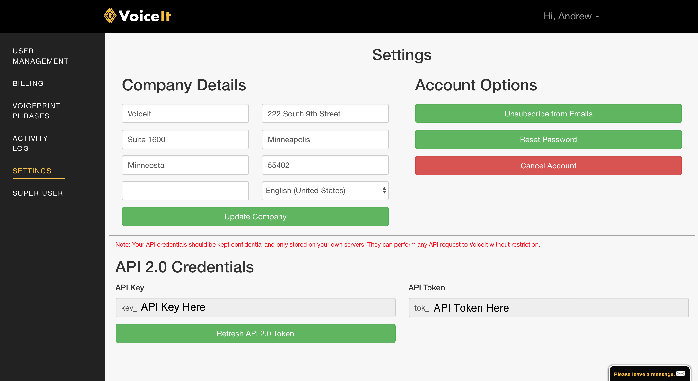

# VoiceIt 2 Android SDK [](https://travis-ci.org/voiceittech/VoiceIt2-AndroidSDK)

A fully comprehensive SDK that gives you access to VoiceIt's API 2.0 featuring Voice + Face Verification and Identification right in your Android app.

* [Getting Started](#getting-started)
* [Requirements](#requirements)
* [Installation](#installation)
* [Local Installation](#local-installation)
* [API Calls](#api-calls)
  * [Initialization](#initialization)
  * [Liveness Detection](#liveness-detection)
  * [Encapsulated Methods](#encapsulated-methods)
      * [Encapsulated Voice Enrollment](#encapsulated-voice-enrollment)
      * [Encapsulated Voice Verification](#encapsulated-voice-verification)
      * [Encapsulated Voice Identification](#encapsulated-voice-identification)
      * [Encapsulated Face Enrollment](#encapsulated-face-enrollment)
      * [Encapsulated Face Verification](#encapsulated-face-verification)
      * [Encapsulated Face Identification](#encapsulated-face-identification)
      * [Encapsulated Video Enrollment](#encapsulated-video-enrollment)
      * [Encapsulated Video Verification](#encapsulated-video-verification)
      * [Encapsulated Video Identification](#encapsulated-video-identification)
  * [Other API Calls](#other-api-calls)
* [Theme](#setting-the-theme)


## UI Screenshots
The following show Voice Verification, Face Verification (With liveness detection on) and Video Verification (with Liveness turned off), respectively.

<div style="background: #000 !important;">
  
</div>

## Getting Started

Sign up for a free Developer Account at <a href="https://voiceit.io/signup" target="_blank">VoiceIt.io</a> and view your API Key and Token in the settings page (as shown below). You can also review the HTTP Documentation at <a href="https://api.voiceit.io" target="_blank">api.voiceit.io</a>.



## Requirements
#### SDK Version
The minumum Android SDK version (API level) should be set to 17 in your build.gradle file: 
```
minSdkVersion: 17
```

#### Billing 
In order to use en-US or other content languages you need to have a developer account that has funds. In order to add funds to your account please login at: https://voiceit.io/login and navigate to: https://voiceit.io/billing and add funds.

#### Voiceprint Phrases 
Make sure you review your Voiceprint Phrases by navigating to: https://voiceit.io/phraseManagement in order to know what to pass for voicePrintPhrase parameter

#### AndroidX
Make sure your project has the useAndroidX and enableJetifier flags as true: Navigate to the gradle.properties of your project and add the following: 
```
android.useAndroidX=true
android.enableJetifier=true
```

## Installation

VoiceItApi2AndroidSDK is available through [JitPack](https://jitpack.io/#voiceittech/VoiceItApi2AndroidSDK/).

## Local Installation
<ul>
 <li> Clone the repo
 <li> Open your android project in android studio, and navigate to File -> New -> Import Module
 <li> Select the Android SDK repo that you just cloned. Check off the app module, only include the voiceit2 module
</ul>

## API Calls

### Initialization

First import *VoiceItAPI2* and then initialize a reference to the SDK inside an Activity, passing in your API Credentials or user token.

```java
import com.loopj.android.http.JsonHttpResponseHandler;
import cz.msebera.android.httpclient.Header;
import org.json.JSONObject;

import com.voiceit.voiceit2.VoiceItAPI2;

public class MainActivity extends AppCompatActivity {

    private VoiceItAPI2 myVoiceIt;

    @Override
    protected void onCreate(Bundle savedInstanceState) {
        super.onCreate(savedInstanceState);
        setContentView(R.layout.activity_main);

        // If using user tokens, replace API_KEY below with the user token,
        // and leave the second argument as an empty string
        myVoiceIt = new VoiceItAPI2("API_KEY","API_TOK");
    }
}
```

### API calls

For each API call, a JsonHttpResponseHandler is needed to receive the result of the call. You can override the response handlers like so, and abbreviated with ellipses below:
```java
new JsonHttpResponseHandler() {
    @Override
    public void onSuccess(int statusCode, Header[] headers, JSONObject response) {
        System.out.println("JSONResult : " + response.toString());
    }

    @Override
    public void onFailure(int statusCode, Header[] headers, Throwable throwable, JSONObject errorResponse) {
        if (errorResponse != null) {
            System.out.println("JSONResult : " + errorResponse.toString());
        }
    }
});
```

### Liveness Detection

For our Encapsulated Face and Video Verification methods, liveness detection can be enabled by parameter. 
This enables a pre-check(prompting to the user to turn their head or smile) before the verification API call to decrease the chance a user is able to spoof with a photo of someone else. This helps to mitigate replay attacks.

### Encapsulated Methods

Encapsulated Methods take care of all the logic of enrollment/verification and the UI in new Android Activities.
Immediately upon calling a method it displays a enrollment/verification view controller that enrolls/verifies the user and 
provides relevant callbacks for whether the API calls were successful or not with associated biometric confidence.
Note: If less than the required enrollments exist for a user, enrollment methods delete them and re-enroll.

#### Encapsulated Voice Enrollment

Create three voice enrollments user with given userId(begins with 'usr_'), contentLanguage('en-US','es-ES' etc.), and a given phrase such as "Never forget tomorrow is a new day".

```java
myVoiceIt.encapsulatedVoiceEnrollment(Activity, "USER_ID_HERE", "CONTENT_LANGUAGE_HERE", "PHRASE_HERE", new JsonHttpResponseHandler() {...});
```

#### Encapsulated Voice Verification

Verify user with given userId(begins with 'usr_'), contentLanguage('en-US','es-ES' etc.), and a given phrase such as "Never forget tomorrow is a new day".

```java
myVoiceIt.encapsulatedVoiceVerification(Activity, "USER_ID_HERE", "CONTENT_LANGUAGE_HERE", "PHRASE_HERE", new JsonHttpResponseHandler() {...});
```

#### Encapsulated Voice Identification

Identify user from given groupId(begins with 'grp_'), contentLanguage('en-US','es-ES' etc.), and a given phrase such as "Never forget tomorrow is a new day".

```java
myVoiceIt.encapsulatedVoiceIdentification(Activity, "GROUP_ID_HERE", "CONTENT_LANGUAGE_HERE", "PHRASE_HERE", new JsonHttpResponseHandler() {...});
```

#### Encapsulated Face Enrollment

Create three face enrollments for user with given userId(begins with 'usr_').

```java
myVoiceIt.encapsulatedFaceEnrollment(Activity, "USER_ID_HERE", new JsonHttpResponseHandler() {...});
```

#### Encapsulated Face Verification

Verify user with given userId(begins with 'usr_'), and a boolean to enable liveness detection.

```java
myVoiceIt.encapsulatedFaceVerification(Activity, "USER_ID_HERE", true, new JsonHttpResponseHandler() {...});
```

with optional boolean to disable or enable liveness tutorial: 

```
myVoiceIt.encapsulatedFaceVerification(Activity, "USER_ID_HERE", true, true, new JsonHttpResponseHandler() {...});
```

#### Encapsulated Face Identification

Identify user from given groupId(begins with 'grp_'), and a boolean to enable liveness detection.

```java
myVoiceIt.encapsulatedFaceIdentification(Activity, "GROUP_ID_HERE", true, new JsonHttpResponseHandler() {...});
```

#### Encapsulated Video Enrollment

Create three video enrollments for user with given userId(begins with 'usr_') and contentLanguage('en-US','es-ES', etc.), and a given phrase such as "my face and voice identify me".

```java
myVoiceIt.encapsulatedVideoEnrollment(Activity, "USER_ID_HERE", "CONTENT_LANGUAGE_HERE", "PHRASE_HERE", new JsonHttpResponseHandler() {...});
```

#### Encapsulated Video Verification

Verify user with given userId(begins with 'usr_'), contentLanguage('en-US','es-ES' etc.), a given phrase such as "my face and voice identify me", and a boolean to enable liveness detection.

```java
myVoiceIt.encapsulatedVideoVerification(Activity, "USER_ID_HERE", "CONTENT_LANGUAGE_HERE", "PHRASE_HERE", true, new JsonHttpResponseHandler() {...});
```
With optional boolean to enable or disable liveness tutorial: 

```java
myVoiceIt.encapsulatedVideoVerification(Activity, "USER_ID_HERE", "CONTENT_LANGUAGE_HERE", "PHRASE_HERE", true, true, new JsonHttpResponseHandler() {...});
```

#### Encapsulated Video Identification

Identify user from given groupId(begins with 'grp_'), contentLanguage('en-US','es-ES' etc.), a given phrase such as "my face and voice identify me", and a boolean to enable liveness detection.

```java
myVoiceIt.encapsulatedVideoIdentification(Activity, "GROUP_ID_HERE", "CONTENT_LANGUAGE_HERE", "PHRASE_HERE", true, new JsonHttpResponseHandler() {...});
```

### Setting The Theme

To set the theme, please initialize the voiceit Module with the Color integer as the third argument: 

```
myVoiceIt = new VoiceItAPI2("API_KEY","API_TOK", Color.parseColor("HEX_COLOR_VALUE_HERE"));
```
Please make sure that the color is a valid Hex value. The parseColor method throws an IllegalArgumentException so it is recommended to wrap the initialize method in try-catch blocks

### Other API Calls

Please refer to https://api.voiceit.io/?java# for information about all API calls

*Remember to add "new JsonHttpResponseHandler() {...}" as the last argument*

For example, you can check whether a user exists for the given userId(begins with 'usr_')
```java
myVoiceIt.checkUserExists("USER_ID_HERE", new JsonHttpResponseHandler() {...});
```

## Strings and Prompts

All strings and prompts utilized in the encapsulated views can be overwitten by adding strings with the same names as found in:
```
/voiceit2/src/main/res/values/strings.xml
```
to the strings.xml file in your app.

## Contact

support@voiceit.io

## Author

VoiceIt Technologies, LLC.

## License

VoiceItApi2AndroidSDK is available under the MIT license. See the LICENSE file for more info.
