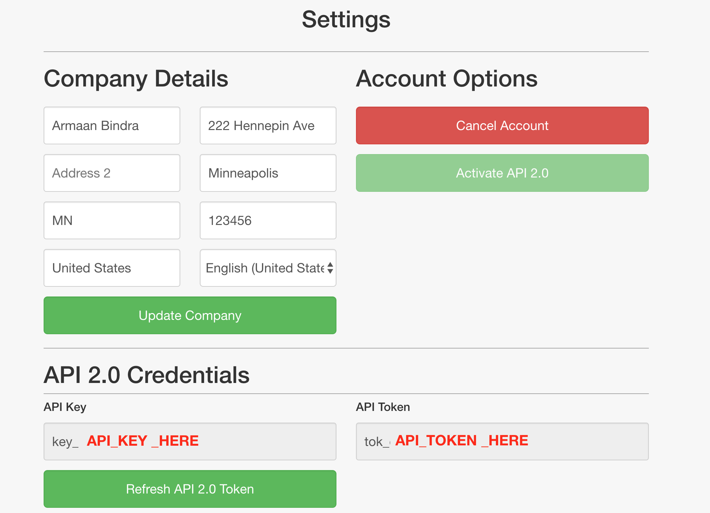

# VoiceItApi2AndroidSDK


A fully comprehensive SDK that gives you access to the VoiceIt's New VoiceIt API 2.0 featuring Voice + Face Verification and Identification right in your Android app.

* [Getting Started](#getting-started)
* [Installation](#installation)
* [API Calls](#api-calls)
  * [Initialization](#initialization)
  * [User API Calls](#user-api-calls)
      * [Get All Users](#get-all-users)
      * [Create User](#create-user)
      * [Get User](#check-if-user-exists)
      * [Get Groups for User](#get-groups-for-user)
      * [Delete User](#delete-user)
  * [Group API Calls](#group-api-calls)
      * [Get All Groups](#get-all-groups)
      * [Create Group](#create-group)
      * [Get Group](#get-group)
      * [Delete Group](#delete-group)
      * [Group exists](#check-if-group-exists)
      * [Add User to Group](#add-user-to-group)
      * [Remove User from Group](#remove-user-from-group)      
  * [Enrollment API Calls](#enrollment-api-calls)
      * [Get All Enrollments for User](#get-all-enrollments-for-user)
      * [Delete Enrollment for User](#delete-enrollment-for-user)
      * [Create Audio Enrollment](#create-voice-enrollment)
      * [Create Video Enrollment](#create-video-enrollment)
      * [Encapsulated Video Enrollment](#encapsulated-video-enrollment)
  * [Verification API Calls](#verification-api-calls)
      * [Audio Verification](#voice-verification)
      * [Video Verification](#video-verification)
      * [Encapsulated Video Verification](#encapsulated-video-verification)
  * [Identification API Calls](#identification-api-calls)
      * [Audio Identification](#voice-identification)
      * [Video Identification](#video-identification)

## Getting Started

Get a Developer Account at <a href="https://voiceit.io/signup" target="_blank">VoiceIt</a> and activate API 2.0 from the settings page. Then you should be able view the API Key and Token (as shown below). Also review the HTTP Documentation at <a href="https://api.voiceit.io" target="_blank">api.voiceit.io</a>.



## Installation

VoiceItApi2AndroidSDK is available through [JitPack](https://jitpack.io/#voiceittech/VoiceItApi2AndroidSDK/).

## API Calls

### Initialization

First import *VoiceItAPI2* and then initialize a reference to the SDK inside a Activity, passing in the API Credentials.

```java
import com.loopj.android.http.JsonHttpResponseHandler;
import cz.msebera.android.httpclient.Header;
import org.json.JSONObject;

import com.voiceit.voiceit2.VoiceItAPI2;

public class MainActivity extends AppCompatActivity {

    public VoiceItAPI2 myVoiceIt2;
    public Activity mActivity;

    @Override
    protected void onCreate(Bundle savedInstanceState) {
        super.onCreate(savedInstanceState);
        setContentView(R.layout.activity_main);

        myVoiceIt2 = new VoiceItAPI2("API_KEY","API_TOK");
        mActivity = this;
    }
}
```

### API calls

For each API call, a JsonHttpResponseHandler is needed to receive the result of the call. You can Override the response handlers like so, and abbreviated below:
```java
new JsonHttpResponseHandler() {
    @Override
    public void onSuccess(int statusCode, Header[] headers, JSONObject response) {
        System.out.println("JSONResult : " + response.toString());
    }

    @Override
    public void onFailure(int statusCode, Header[] headers, Throwable throwable, JSONObject errorResponse) {
        if (errorResponse != null) {
            System.out.println("JSONResult : " + errorResponse.toString());
        }
    }
});
```

### User API Calls

#### Get All Users

Get all the users associated with the apiKey
```java
myVoiceIt.getAllUsers(new JsonHttpResponseHandler() {...});
```

#### Create User

Create a new user
```java
myVoiceIt.createUser(new JsonHttpResponseHandler() {...});
```

#### Check if User Exists

Check whether a user exists for the given userId(begins with 'usr_')
```java
myVoiceIt.getUser("USER_ID_HERE", new JsonHttpResponseHandler() {...});
```

#### Delete User

Delete user with given userId(begins with 'usr_')
```java
myVoiceIt.deleteUser("USER_ID_HERE", new JsonHttpResponseHandler() {...});
```

#### Get Groups for User

Get a list of groups that the user with given userId(begins with 'usr_') is a part of
```java
myVoiceIt.getGroupsForUser("USER_ID_HERE", new JsonHttpResponseHandler() {...});
```

### Group API Calls

#### Get All Groups

Get all the groups associated with the apiKey
```java
myVoiceIt.getAllGroups(new JsonHttpResponseHandler() {...});
```

#### Get Group

Returns a group for the given groupId(begins with 'grp_')
```java
myVoiceIt.getGroup("GROUP_ID_HERE", new JsonHttpResponseHandler() {...});
```

#### Check if Group Exists

Checks if group with given groupId(begins with 'grp_') exists
```java
myVoiceIt.groupExists("GROUP_ID_HERE", new JsonHttpResponseHandler() {...});
```

#### Create Group

Create a new group with the given description
```java
myVoiceIt.createGroup("Sample Group Description", new JsonHttpResponseHandler() {...});
```

#### Add User to Group

Adds user with given userId(begins with 'usr_') to group with given groupId(begins with 'grp_')
```java
myVoiceIt.addUserToGroup("GROUP_ID_HERE", "USER_ID_HERE", new JsonHttpResponseHandler() {...});
```

#### Remove User from Group

Removes user with given userId(begins with 'usr_') from group with given groupId(begins with 'grp_')

```java
myVoiceIt.removeUserFromGroup( "GROUP_ID_HERE", "USER_ID_HERE", new JsonHttpResponseHandler() {...});
```

#### Delete Group

Delete group with given groupId(begins with 'grp_'), note: this call does not delete any users, but simply deletes the group and disassociates the users from the group

```java
myVoiceIt.deleteGroup("GROUP_ID_HERE", new JsonHttpResponseHandler() {...});
```

### Enrollment API Calls

#### Get All Enrollments for User

Gets all enrollment for user with given userId(begins with 'usr_')

```java
myVoiceIt.getAllEnrollmentsForuser("USER_ID_HERE", new JsonHttpResponseHandler() {...});
```

#### Delete Enrollment for User

Delete enrollment for user with given userId(begins with 'usr_') and enrollmentId(integer)

```java
myVoiceIt.deleteEnrollmentForUser( "USER_ID_HERE", "ENROLLMENT_ID_HERE", new JsonHttpResponseHandler() {...});
```

#### Create Voice Enrollment

Create audio enrollment for user with given userId(begins with 'usr_') and contentLanguage('en-US','es-ES' etc.). Note: Immediately upon calling this method it records the user saying their VoicePrint phrase for 5 seconds calling the recordingFinished callback first, then it sends the recording to be added as an enrollment and returns the result in the callback

```java
myVoiceIt.createVoiceEnrollment("USER_ID_HERE", "CONTENT_LANGUAGE_HERE", new JsonHttpResponseHandler() {...});
```

#### Create Video Enrollment

Create video enrollment for user with given userId(begins with 'usr_') and contentLanguage('en-US','es-ES' etc.). Note: File recording need to be no less than 1.2 seconds and no more than 5 seconds

```java
myVoiceIt.createVideoEnrollment("USER_ID_HERE", "CONTENT_LANGUAGE_HERE", File video, new JsonHttpResponseHandler() {...});
```

#### Encapsulated Video Enrollment

Create three video enrollments for user with given userId(begins with 'usr_') and contentLanguage('en-US','es-ES', etc.) and a given phrase such as "my face and voice identify me". Note: Immediately upon calling this method it displays the user and enrollment view controller that completely takes care of the three enrollments, including the UI and then provides relevant callbacks for whether the user cancelled their enrollments or successfully completed them.

```java
myVoiceIt.encapsulatedVideoEnrollUser(Activity, "USER_ID_HERE", "CONTENT_LANGUAGE_HERE",  "my face and voice identify me", new JsonHttpResponseHandler() {...});
```
### Verification API Calls

#### Voice Verification

Verify user with the given userId(begins with 'usr_') and contentLanguage('en-US','es-ES' etc.). Note: Immediately upon calling this method it records the user saying their VoicePrint phrase for 5 seconds calling the recordingFinished callback first, then it sends the recording to be verified and returns the resulting confidence in the callback

```java
myVoiceIt.voiceVerification("USER_ID_HERE", "CONTENT_LANGUAGE_HERE", new JsonHttpResponseHandler() {...});
```

#### Video Verification

Verify user with given userId(begins with 'usr_') and contentLanguage('en-US','es-ES' etc.). Note: Immediately upon calling this method it displays the camera and starts recording a video of the user saying their VoicePrint phrase for 5 seconds calling the recordingFinished callback first, then it sends the recording to be added as an enrollment and returns the result in the callback

```java
myVoiceIt.videoVerification("USER_ID_HERE", "CONTENT_LANGUAGE_HERE", File video, new JsonHttpResponseHandler() {...});
```

#### Encapsulated Video Verification

Verify user with given userId(begins with 'usr_') and contentLanguage('en-US','es-ES' etc.). Note: Immediately upon calling this method it displays a view controller with a camera view that verifies the user and provides relevant callbacks for whether the verification was successful or not with associated voice and face confidences

```java
myVoiceIt.encapsulatedVideoVerification(Activity, "USER_ID_HERE", "CONTENT_LANGUAGE_HERE", "my face and voice identify me", new JsonHttpResponseHandler() {...});
```

### Identification API Calls

#### Voice Identification

Identify user inside group with the given groupId(begins with 'grp_') and contentLanguage('en-US','es-ES' etc.). Note: Immediately upon calling this method it records the user saying their VoicePrint phrase for 5 seconds calling the recordingFinished callback first, then it sends the recording to be identified and returns the found userId and confidence in the callback

```java
myVoiceIt.voiceIdentification("GROUP_ID_HERE", "CONTENT_LANGUAGE_HERE", new JsonHttpResponseHandler() {...});
```

#### Video Identification

Identify user inside group with the given groupId(begins with 'grp_') and contentLanguage('en-US','es-ES' etc.). Note: File recording need to be no less than 1.2 seconds and no more than 5 seconds

```java
myVoiceIt.videoIdentification("GROUP_ID_HERE", "CONTENT_LANGUAGE_HERE", File video, new JsonHttpResponseHandler() {...});
```

## Author

Stephen Akers, stephen@voiceit.io

## License

VoiceItApi2AndroidSDK is available under the MIT license. See the LICENSE file for more info.
